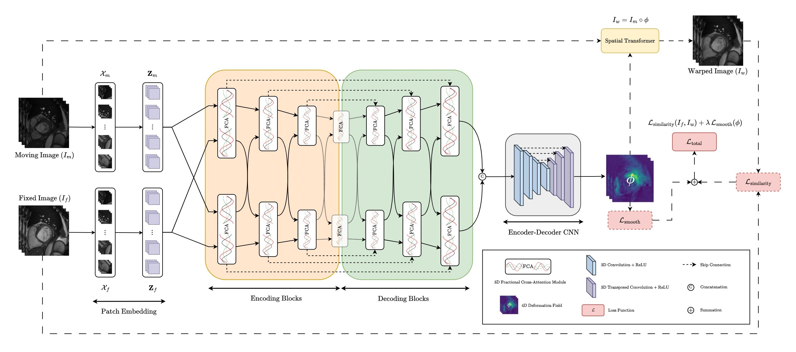

# FractMorph: A Fractional Fourier-Based Multi-Domain Transformer for Deformable Image Registration

<a href= "https://pytorch.org/"> </a>
<a href="https://opensource.org/licenses/MIT"></a>
[](https://arxiv.org/abs/2508.12445)

This repository provides the official implementation of the paper "FractMorph: A Fractional Fourier-Based Multi-Domain Transformer for Deformable Image Registration".

[[Graphical Abstract](figures/graphical-abstract.png)] [[Paper](https://arxiv.org/pdf/2508.12445)] [[Code](https://github.com/shayankebriti/FractMorph)]

## Architecture Overview
An overview of the FractMorph framework is shown below. Given a moving and a fixed 3D image, the model estimates the corresponding 4D deformation field. By novel integration of the fractional Fourier transform with a dual-parallel Transformer, the architecture simultaneously captures local, semi-global, and global context within a single end-to-end network.



## 3D Fractional Cross-Attention Module
The figure below presents the architecture of the multi-domain Fractional Cross-Attention (FCA) module.


## 3D Fractional Fourier Transform
The images below display the magnitude and phase outputs of our 3D FrFT at various fractional orders. For illustration, only one 2D slice from the volume is shown.


The implementation of the 3D FrFT can be found in [`modules/frft3d.py`](modules/frft3d.py).

## Citation
If you find this code useful in your work, please consider citing:
```bibtex
@article{kebriti2025fractmorph,
  title={FractMorph: A Fractional Fourier-Based Multi-Domain Transformer for Deformable Image Registration},
  author={Kebriti, Shayan and Nabavi, Shahabedin and Gooya, Ali},
  journal={arXiv preprint arXiv:2508.12445},
  year={2025}
}
```